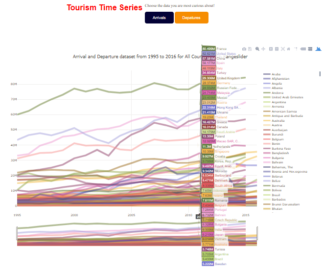

# Introduction
In 2017, I was able to travel a lot around the world. Going to some of the most visited cities in the world including Paris, Rome, Singapore, Bangkok and Hong Kong. This made me curious to see how tourism has evolved with time and which countries benefit the most from this global industry. As I have previously worked with D3.js to visualize world data, I thought this would be the perfect continuation to my data science adventure. I decided to write my code and analysis in R Markdown so that I can practice my data presentation skills. All works are hosted on my personal website and Github account.

Github Link: <https://github.com/archidisign/Data-Visualization/tree/master/D3/Tourism-Map>

Interactive D3 Visualization Link: <https://archidisign.github.io/projects.html>

## Understanding the Dataset
We have the dataset for both the arrival and departure numbers per year of each country. For this project, the comparison of the two datasets is a priority as they bring out very different, but important information. In the future, it would be interesting to see how we can visualize the two together. The dataset was prepared by the World Development Indicators and I have copied their methodology/definition on the README of this project. In total, we are looking at 217 countires' data span over 21 years: from 1995 to 2016. As the dataset was created in 2017, some of the values from 2016 were missing. For this project, we will focus on the data of 1995 to 2015.

## Hypothesis and Assumptions
From experience, I am expecting countries in Europe like France and Italy to get the most arrival traction. Resort countries like Thailand and Cubo should also get a fair number of arrivals as they are popular choice for a relaxing vacation. As for departure, I am expecting Western countries like USA, UK and Canada to have the highest number of tourists going abroad over time. Furthermore, with the economic boom Asian countries received in the last decade, I would expect China's new upper-middle class to contribute significantly to the tourism industry.

# Data Cleaning
Within the csv file, each row did not just represent a different country. Instead, aggregation by regions and total were also present. Hence, a first data cleaning was done in EXCEL to filter these rows out from the dataset. Furthermore, we needed to do different vlookup for the data analysis such that the various files loaded can be represented inside one big csv/dataframe.

From there, the newly defined csv files are loaded into R.Some countries have missing data. If the dataset has a nan value, it is replaced by a 0. Furthermore, the last 3 columns are factors, not numerical values. Hence, in R, we want to exclude these from the initial part of our analysis (when we want to visualize histograms, find max/min, etc). Finally, the rownames are defined as the country names. This work is repeated twice, for both arrival and departure dataset.
```{r}
#Define dataframe for arrival
arrival <- read.csv('./data/arrivals_R.csv')
arrival[is.na(arrival)]<-0
arr_num <- arrival[, -24:-26]
rownames(arr_num) <- arr_num[,1]
arr_num[,1] <-NULL
#Define dataframe for departure
departure <- read.csv('./data/departures_R.csv')
departure[is.na(departure)]<-0
dep_num <- departure[, -24:-26]
rownames(dep_num) <- dep_num[,1]
dep_num[,1] <-NULL
```

# Data Exploration
Below are some of the initial data visualization done to better visualize and understand the data at hand. In Data Science, this stage is called the Data Exploration. We are not sure in which direction to go with the project and visualizing the data in different ways allows us to know what to do next.

## Find Max and Min
```{r}
#MAXIMUM for Arrival
idx1 <- which(arr_num==max(arr_num), arr.ind = TRUE)
print(c(rownames(arr_num)[idx1[1]], colnames(arr_num)[idx1[2]], arr_num[idx1]))
#rbind(rownames(arr_num), colnames(arr_num)[apply(arr_num,1,which.max)])

#MINIMUM for Arrival
idx2 <- which(arr_num == min(arr_num[arr_num>0]), arr.ind = TRUE)
print(c(rownames(arr_num)[idx2[1]], colnames(arr_num)[idx2[2]], arr_num[idx2]))

#MAXIMUM for Departure
idx1 <- which(dep_num==max(dep_num), arr.ind = TRUE)
print(c(rownames(dep_num)[idx1[1]], colnames(dep_num)[idx1[2]], dep_num[idx1]))

#MINIMUM for Departure
idx2 <- which(dep_num == min(dep_num[dep_num>0]), arr.ind = TRUE)
print(c(rownames(dep_num)[idx2[1]], colnames(dep_num)[idx2[2]], dep_num[idx2]))
```
From the above, we see that France is the most popular country to visit, having 84,452,000 arrivals in 2015. Tajikistan, an Europe & Central Asia	Lower middle income country, is the least visited. Its smallest number was in 1996 when it received around 700 arrivals. Although uncertain yet, we may assume that overall, the number of both arrival and departure is increasing with years.


## Histogram and Data Distribution
```{r}
options("scipen"=100, "digits"=4)
par(mfrow=c(1,2))
hist(arr_num$X1995, main='Distribution of arrivals in 1995', ylab='Number of arrivals')
hist(arr_num$X2015, main='Distribution of arrivals in 2015', ylab='Number of arrivals')
```

```{r}
options("scipen"=100, "digits"=4)
par(mfrow=c(1,2))
hist(dep_num$X1995, main='Distribution of departures in 1995', ylab='Number of departures')
hist(dep_num$X2015, main='Distribution of departures in 2015', ylab='Number of departures')
```
This shows us that the data is right skewed with only a few countries reaching the 20 millions count. It also seems to be unreasonable to do a prediction model based on a standard normal distribution. Even exponential and gamma distribution may be hard to tune onto these datasets.

## World Map Visualization
Project Link: <https://archidisign.github.io/tourism-map/world_map.html>


Visit the project link to see the data visualization for yourself. As you may notice with the histograms, the values are extremly parse. Having the mapping color depending on a linear function would cause any country having below one million visitors to be completely white on the map. The solution to this is by defining the Continuous color mapping based on a square root or a logarithmic function. Visually, this allows us to see that USA, UK and France are some of the countries most visited. As for departure data, USA, Germany and UK should be highlighted for their high tourism departure rate. For both arrival and departure, we see the evolution of countries like China and Russia where the values increases each year for both arrival and departures. This is a huge testament to their economic strength.

Overall, a visual map allows us to visually see the global evolution of arrival and departure over time. Its strength is its ability to highlight the countries by country and those with high geographical size are easier to spot. Hence, the next step is to visualize these values numerically as trends.


## Time series
Project Link: <https://archidisign.github.io/tourism-map/time_series.html>



Already, we can see that a time series is the best way to visualize the data. Even with 217 countries to plot, the maximum values are standing out. Values we may consider as outliers when looking into a histogram are becoming the values of interest here.

First, for the arrival dataset. We see that the most visited country is far ahead France. Spain and United States are fighting diligently for the second and third place over the last 20 years. Just like France, European's big cultural housename Italy and the United Kingdom are consistently welcoming a high number of visitors each year. As for China, there is no surprise to see its exponential increase over time as more and more people are looking to venture in this Asian super economic power.

Second, for the departure dataset. Countries having high departure rate shows that the countries have middle and upper classes ready to spend money abroad: it is another indication of a country's economic strength. Germany, Hong Kong, the UK and the USA are the coutnries with the steadiest high tourism departure rate. As for increadily rate growth, China's departure rate is the most amazing, going from 17th place in 2000 with 10 millions departure to 1st place in 2015 with 116 millions departure.

Overall, it is interesting to see that there is always change happening in the tourism popularity chart. This shows us that the tourism industry is volatile and depending on current events. However, the stronger the country's cultural root, the steadier it is at keeping a high tourist arrival rate.

## Heatmap
This is the last and bonus step of the data exploration! I love heatmaps because thy are simply visually stunning. As there are 217 countries in our dataset and it makes the analytics extremely difficult, I have decided to once again focus on the top most active countries only (20 highest arrival and departure rate respectively).

```{r fig2, fig.width = 20, fig.align = "center"}
library("RColorBrewer")
arr_temp <- arr_num
arr_temp$total <- rowSums(arr_temp)
arr_temp <- head(arr_temp[order(arr_temp$total, decreasing= T),], n = 20)
arrival_matrix <- data.matrix(arr_temp)
arrival_heat <- heatmap(arrival_matrix, Rowv=NA, Colv=NA, col = brewer.pal(9, "Blues"), scale="column", margins=c(5,10))
```

```{r fig.width = 25, fig.align = "center"}
dep_temp <- dep_num
dep_temp$total <- rowSums(dep_temp)
dep_temp <- head(dep_temp[order(dep_temp$total, decreasing= T),], n = 20)
departure_matrix <- data.matrix(dep_temp)
departure_heat <- heatmap(departure_matrix, Rowv=NA, Colv=NA, col = brewer.pal(9, "Oranges"), scale="column", margins=c(5,10))
```

These graphs sum up well the previous conclusions done using histogram, geographical mapping and time series trend analysis.

# Statistics Analysis
Now, we are ready to dig into more complex statistical analysis.

## Boxplot Per Year
```{r}
boxplot(arr_num, main = "Arrival Data Boxplots Per Year", notch = TRUE, col = 1:20)
boxplot(dep_num, main = "Departure Data Boxplots Per Year", notch = FALSE, col = 1:20)
```

## Correlation between arrival vs departure

```{r}
x <- arrival$X1995
y <- departure$X1995
plot(x, y, xlab='Number of arrivals', ylab='Number of departures', xlim=c(0, 2000000), ylim=c(0, 2000000))
x <- arrival$X2015
y <- departure$X2015
plot(x, y, xlab='Number of arrivals', ylab='Number of departures', xlim=c(0, 2000000), ylim=c(0, 2000000))
```

## Linear Regression relation

Correlation between regions/IncomeGroup (correlation matrix, Linear Regression model)
```{r}
arrival$Region<-as.factor(arrival$Region)
arrival$IncomeGroup<-as.factor(arrival$IncomeGroup)
arrival$CountryName<-as.factor(arrival$CountryName)
fit1<-lm(X1995~Region,data=arrival)
summary(fit1)
anova(fit1)
```
From the above tables, we can see that the p-value for the regions is extremely small. Based on the global F-test, there is a significant difference between the number of arrivals between geographical regions. To assess the validy of models bsed on regions, we will need to look at the residual plots.
```{r}
unique(arrival$Region)
res.data<-data.frame(res=residuals(fit1), Region=arrival$Region)
par(mar=c(4,4,1,2))
stripchart(res~Region,res.data,pch=19,vertical=T,xlab='Region', las=2)
abline(h=0,lty=2)
```
This residual plot shows us that the East Asia & Pacific and the South Asia are the two regions with the smallest variabce.

## Forecasting Models
1) Try main effect model: Region+IncomeGroup+CountryName
2) Etc.. A4Q3
## Predictions for trend into the future

## Conclusion