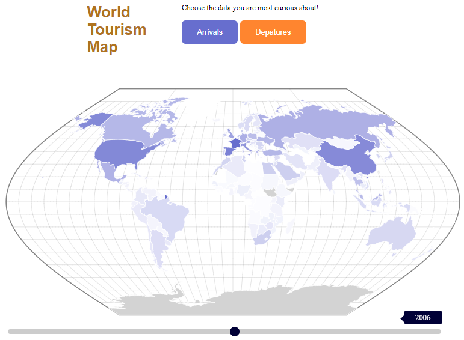
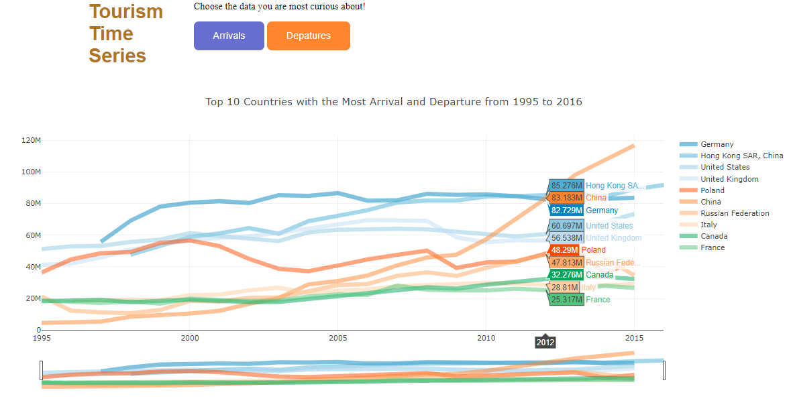

# Introduction
In 2017, I was able to travel a lot around the world. Going to some of the most visited cities in the world including Paris, Rome, Singapore, Bangkok and Hong Kong. This made me curious to see how tourism has evolved with time and which countries benefit the most from this global industry. As I have previously worked with D3.js to visualize world data, I thought this would be the perfect continuation to my data science adventure. I decided to write my code and analysis in R Markdown so that I can practice my data presentation skills. All works are hosted on my personal website and Github account.

Github Link: <https://github.com/archidisign/Data-Visualization/tree/master/D3/Tourism-Map>

Interactive D3 Visualization Link: <https://archidisign.github.io/projects.html>

## Understanding the Dataset
We have the dataset for both the arrival and departure numbers per year of each country. For this project, the comparison of the two datasets is a priority as they bring out very different, but important information. The dataset was prepared by the World Development Indicators and I have copied their methodology/definition on the README of this project. In total, we are looking at 217 countires' data span over 21 years: from 1995 to 2016. As the dataset was created in 2017, some of the values from 2016 were missing. For this project, we will focus on the data of 1995 to 2015.

## Hypothesis and Assumptions
From experience, I am expecting countries in Europe like France and Italy to get the most arrival traction. Resort countries like Thailand and Cubo should also get a fair number of arrivals as they are popular choice for a relaxing vacation. As for departure, I am expecting Western countries like USA, UK and Canada to have the highest number of tourists going abroad over time. Furthermore, with the economic boom Asian countries received in the last decade, I would expect China's new upper-middle class to contribute significantly to the tourism industry.

# Data Cleaning
Within the csv file, each row did not just represent a different country. Instead, aggregation by regions and total were also present. Hence, a first data cleaning was done in EXCEL to filter these rows out from the dataset. Furthermore, we needed to do different vlookup for the data analysis such that the various files loaded can be represented inside one big csv/dataframe.

From there, the newly defined csv files are loaded into R.Some countries have missing data. If the dataset has a nan value, it is replaced by a 0. Furthermore, the last 3 columns are factors, not numerical values. Hence, in R, we want to exclude these from the initial part of our analysis (when we want to visualize histograms, find max/min, etc). Finally, the rownames are defined as the country names. This work is repeated twice, for both arrival and departure dataset.
```{r}
#Define dataframe for arrival
arrival_original <- read.csv('./data/arrivals_R.csv')
arrival <- arrival_original
arrival[is.na(arrival)]<-0
arr_num <- arrival[, -24:-26]
rownames(arr_num) <- arr_num[,1]
arr_num[,1] <-NULL
#Define dataframe for departure
departure_original <- read.csv('./data/departures_R.csv')
departure <- departure_original
departure[is.na(departure)]<-0
dep_num <- departure[, -24:-26]
rownames(dep_num) <- dep_num[,1]
dep_num[,1] <-NULL
```

# Data Exploration
Below are some of the initial data visualization done to better visualize and understand the data at hand. In Data Science, this stage is called the Data Exploration. We are not sure in which direction to go with the project and visualizing the data in different ways allows us to know what to do next.

## Maximum and Minimum
```{r}
#MAXIMUM for Arrival
idx1 <- which(arr_num==max(arr_num), arr.ind = TRUE)
print(c(rownames(arr_num)[idx1[1]], colnames(arr_num)[idx1[2]], arr_num[idx1]))
#rbind(rownames(arr_num), colnames(arr_num)[apply(arr_num,1,which.max)])
#MINIMUM for Arrival

idx2 <- which(arr_num == min(arr_num[arr_num>0]), arr.ind = TRUE)
print(c(rownames(arr_num)[idx2[1]], colnames(arr_num)[idx2[2]], arr_num[idx2]))
```
From the above, we see that France is the most popular country to visit, having 84,452,000 arrivals in 2015. Tajikistan, an Europe & Central Asia	Lower middle income country, is the least visited. Its smallest number was in 1996 when it received around 700 arrivals. Although uncertain yet, we may assume that overall, the number of both arrival and departure is increasing with years.

```{r}
#MAXIMUM for Departure
idx1 <- which(dep_num==max(dep_num), arr.ind = TRUE)
print(c(rownames(dep_num)[idx1[1]], colnames(dep_num)[idx1[2]], dep_num[idx1]))

#MINIMUM for Departure
idx2 <- which(dep_num == min(dep_num[dep_num>0]), arr.ind = TRUE)
print(c(rownames(dep_num)[idx2[1]], colnames(dep_num)[idx2[2]], dep_num[idx2]))
```
As for departure, China definitely has the edge currently as the country with the most departures: it saw 116 millions of its population traveling abroad in 2015. 

## Histogram and Data Distribution
```{r}
options("scipen"=100, "digits"=4)
par(mfrow=c(1,2))
hist(arr_num$X1995, main='Distribution of arrivals in 1995', ylab='Number of arrivals')
hist(arr_num$X2015, main='Distribution of arrivals in 2015', ylab='Number of arrivals')
```

```{r}
options("scipen"=100, "digits"=4)
par(mfrow=c(1,2))
hist(dep_num$X1995, main='Distribution of departures in 1995', ylab='Number of departures')
hist(dep_num$X2015, main='Distribution of departures in 2015', ylab='Number of departures')
```
This shows us that the data is right skewed with only a few countries reaching the 20 millions count. It also seems to be unreasonable to do a prediction model based on a standard normal distribution. Even exponential and gamma distribution may be hard to tune onto these datasets.


For the following two visualizations, I decided to make them using D3.js because I felt like it was the best way to interactively explore the dataset.
## World Map Visualization
Project Link: <https://archidisign.github.io/tourism-map/world_map.html>


Visit the project link to see the data visualization for yourself. As you may notice with the histograms, the values are extremly parse. Having the mapping color depending on a linear function would cause any country having below one million visitors to be completely white on the map. The solution to this is by defining the Continuous color mapping based on a square root or a logarithmic function. Visually, this allows us to see that USA, UK and France are some of the countries most visited. As for departure data, USA, Germany and UK should be highlighted for their high tourism departure rate. For both arrival and departure, we see the evolution of countries like China and Russia where the values increases each year for both arrival and departures. This is a huge testament to their economic strength.

Overall, a visual map allows us to visually see the global evolution of arrival and departure over time. Its strength is its ability to highlight the countries by country and those with high geographical size are easier to spot. Hence, the next step is to visualize these values numerically as trends.


## Time series
Project Link: <https://archidisign.github.io/tourism-map/time_series.html>



Already, we can see that a time series is the best way to visualize the data. Even with 217 countries to plot, the maximum values are standing out. Values we may consider as outliers when looking into a histogram are becoming the values of interest here.

First, for the arrival dataset. We see that the most visited country is far ahead France. Spain and United States are fighting diligently for the second and third place over the last 20 years. Just like France, European's big cultural housename Italy and the United Kingdom are consistently welcoming a high number of visitors each year. As for China, there is no surprise to see its exponential increase over time as more and more people are looking to venture in this Asian super economic power.

Second, for the departure dataset. Countries having high departure rate shows that the countries have middle and upper classes ready to spend money abroad: it is another indication of a country's economic strength. Germany, Hong Kong, the UK and the USA are the coutnries with the steadiest high tourism departure rate. As for increadily rate growth, China's departure rate is the most amazing, going from 17th place in 2000 with 10 millions departure to 1st place in 2015 with 116 millions departure.

Overall, it is interesting to see that there is always change happening in the tourism popularity chart. This shows us that the tourism industry is volatile and depending on current events. However, the stronger the country's cultural root, the steadier it is at keeping a high tourist arrival rate.

## Heatmap
This is the last and bonus step of the data exploration! I love heatmaps because thy are simply visually stunning. As there are 217 countries in our dataset and it makes the analytics extremely difficult, I have decided to once again focus on the top most active countries only (20 highest arrival and departure rate respectively).

```{r fig2, fig.width = 20, fig.align = "center"}
library("RColorBrewer")
arr_temp <- arr_num
arr_temp$total <- rowSums(arr_temp)
arr_temp <- head(arr_temp[order(arr_temp$total, decreasing= T),], n = 20)
arrival_matrix <- data.matrix(arr_temp)
arrival_heat <- heatmap(arrival_matrix, Rowv=NA, Colv=NA, col = brewer.pal(9, "Blues"), scale="column", margins=c(5,10))
```

```{r fig.width = 25, fig.align = "center"}
dep_temp <- dep_num
dep_temp$total <- rowSums(dep_temp)
dep_temp <- head(dep_temp[order(dep_temp$total, decreasing= T),], n = 20)
departure_matrix <- data.matrix(dep_temp)
departure_heat <- heatmap(departure_matrix, Rowv=NA, Colv=NA, col = brewer.pal(9, "Oranges"), scale="column", margins=c(5,10))
```

These graphs sum up well the previous conclusions done using histogram, geographical mapping and time series trend analysis. For prettier output, I first sorted the values from largest to smallest total arrival/departure count.The colors are taken from the RColorBrewer library. Year 2016 is of course an outlier year since it is missing most data points and the column's color is not representative to the year's tourism numbers.

# Statistics Analysis
Now, we are ready to dig into more complex statistical analysis using the built-in functions of R. so far, we only looked at the country and year information from the dataset. However, each country is actually differentiated based on the region it comes from and its income group. If we want to do forecasting, these factors are extremely important to the overall analyze.

## Maximum/Minimum/Median/Mean and Boxplots per Year
```{r}
summary(arrival_original[, -24:-26])
boxplot(arr_num, main = "Arrival Data Boxplots Per Year", notch = TRUE, col = 1:20)
```
Although the summary function allows us to see the acutal numbers, the boxplots can visually highlight the important elements of the dataset. From Stat Tek:

> A boxplot splits the data set into quartiles. The body of the boxplot consists of a "box" (hence, the name), which goes from the first quartile (Q1) to the third quartile (Q3).

The vertical line in the middle of the box is the median, while as the borders of the box are the 1st and 3rd quantiles. Outliers are plotted separately as points on the chart. A boxplot hence visualize exactly the information given to us through the summary function. It allows us to see the shape of the data set. With so many high outliers each year, the data is skewed right. Furthermore, it seems that the high arrival outliers are increasing value each year.


```{r}
summary(departure_original[, -24:-26])
boxplot(dep_num, main = "Departure Data Boxplots Per Year", notch = FALSE, col = 1:20)
```
The same conclusion can be done on the departure data set. Once again, we see that the data is skewed right. The number of outliers seem to increase faster with time compared to the arrival data set and it seems to have a bit less outliers.

## Correlation between arrival vs departure

So far, we have compared the arrival and departure data sets seperately. However, there is a simple way to compare them within the same plot and make some statistical conclusion: Correlation/Dependence graph. In an ideal world, every country would have approximately the same number of inbound as the number outbound tourist. In such a case, the above two graphs would see a linear 1:1 trend. Below, we plot this line in blue. However, with many factors such as economic strength, cultural and politcal events and other reasons, the trend is far from been linear.

```{r}
x <- arrival$X1995
y <- departure$X1995
s <- arrival$X2015
t <- departure$X2015
plot(x, y, main='Correlation Between Arrivals and Departures 1995', xlab='Number of arrivals', ylab='Number of departures', xlim=c(0, 2000000), ylim=c(0, 2000000))
abline(a=0, b=1, col="blue")
plot(s, t, main='Correlation Between Arrivals and Departures 2015', xlab='Number of arrivals', ylab='Number of departures', xlim=c(0, 2000000), ylim=c(0, 2000000))
abline(a=0, b=1, col="blue")
```
Now, the comparison between the years is becoming more interesting. We see that in 1995, more outliers (data points far from the blue benchmark line) are close to the departures side. On the other hamd ,the outliers seem to shift toward the arrival side in 2015. This implies that as time pass by, most outlier countries receive more tourists inside their country then having their own population travel abroad. This can be explained by megapowers like China where there is an exode of external traveling toward various countries (one to many relationship). Furthermore, with globalisation, many middle class people can now afford to travel around the world. This causes many of these countries to see an increase in their annual tourism arrival rate. 

# Linear Regression Model

As you may remember, within the dataset, we also have information about the income and the region grouping for each country. This implies we can use linear regression and factoring to define a prediction model. As the work is similar for both arrival and departure dataset, I will concentrate on doing the linear regression and prediction models for only the arrival dataset during the year 2015 as it is the time period most relevant to our current time frame. Let us first start with main effective model (having only the factors region and income group).

## Linear Fit Summary and ANOVA table

```{r}
arrival$Region<-as.factor(arrival$Region)
arrival$IncomeGroup<-as.factor(arrival$IncomeGroup)
fit1<-lm(X2015~Region+IncomeGroup,data=arrival)
summary(fit1)
anova(fit1)
```
From the above tables, we can see that the p-value for the regions is extremely small. Based on the global F-test, there is a significant difference between the number of arrivals between geographical regions. On the other hand, the income group factor has a p-value 0.24 and a F-value of 1.41. The income group difference is hence less influential on the model. 

To assess the validy of models based on region and income groups, we need to look at the residual plots.

```{r}
unique(arrival$Region)
res.data<-data.frame(res=residuals(fit1), Region=arrival$Region)
par(mar=c(4,4,1,2))
stripchart(res~Region,res.data,pch=19,vertical=T,xlab='Region', las=2)
abline(h=0,lty=2)
```
This residual plot shows us that the East Asia & Pacific and the South Asia are the two regions with the smallest variance.

```{r}
unique(arrival$IncomeGroup)
res.data<-data.frame(res=residuals(fit1), Region=arrival$IncomeGroup)
par(mar=c(4,4,1,2))
stripchart(res~arrival$IncomeGroup,res.data,pch=19,vertical=T,xlab='Income Group', las=2)
abline(h=0,lty=2)
```
As for Income Groups, the high income counries have the highest variance while low income and lower middle income have the least. This is expected as all the countries with high tourist counts were economical powerhouse.

## Find Best Linear Model through Statistical Testing

The first fitted model is the main effect model: it looks at the values of the year 2015 in the arrival dataset based on the two factorization: Region and Income group.
```{r}
drop1(fit1,test='F')
```
As IncomeGroup has a p-value of 0.24183, it seems that we can drop the IncomeGroup factor from the model. Let us we update the model by dropping it, and computing the summaries and comparison statistics.
```{r}
fit2<-update(fit1, ~.-IncomeGroup)
print(summary(fit2), concise=TRUE)
anova(fit2, fit1,test='F')
AIC(fit1,fit2)
```
We are happy to see that the AIC value of the newly fitted model is smaller than the first one, showing that the accuracy of the model has improved. Next, let us consider the interactions between the factors, if they have effects on the model.
```{r}
fit3<-update(fit2,~.+Region*IncomeGroup)
fit4<-update(fit3,~.-Region:IncomeGroup)
anova(fit2,fit4,fit3,test='F')
AIC(fit2,fit4,fit3)
```
From the AIC values, we can conclude that these interactions do not seem to improve the model. Let us attempt a few other possible models.
```{r}
fit5<-update(fit2,~.+Region:IncomeGroup)
anova(fit2,fit5,test='F')
AIC(fit2,fit5)
BIC(fit2,fit5)
```
Still, fitted model 2 which considers only the independent variable Region seems to be preferred. We have now seen all the possible models. Based on the Sum of Squares Residuals, AIC, BIC and adjusted R^2 values, it seems the model of arrival$x2015~Region without any interaction is the best fitted model. We may hence conclude that, with the information we received, the best fitted model to do prediction on the future of arrival tourism counts in future years is depending on the Region the country is categorized in. The income group is of less importance.

# Conclusion
In conclusion, for this project we were able to better understand our dataset through data exploration, data visualization and data analysis. It was a tedious statistic project. Multiple visualization tools were used including R's built-in functions, histograms and heatmap. Also, we used D3 to visualize data on a map and through interactive time series. This showed that many western countries with long cultural histories like France are some of the favorite countries to visit. On the other hand, countries like China who have strong middle class spending power are traveling more abroad as years pass by. Of course, USA, UK and Germany are still some of the strongest economic powerhouse as they receive high inbound and outbound travels. Furthermore, we got to expand on the dataset through looking at mean/median/maximum/minium, boxplots and correlation graphs. Finally, we did an in-depth linear regrission analysis using ANOVA table and F-test. From this, we concluded that a country's tourism count depends more on the region it is located in then on the country's income group.

Overall, this was an extremly project to work on. In the future, it would be interesting to look at the spendings people make when traveling and how internation events like the Olympics can affect a country's tourism industry.